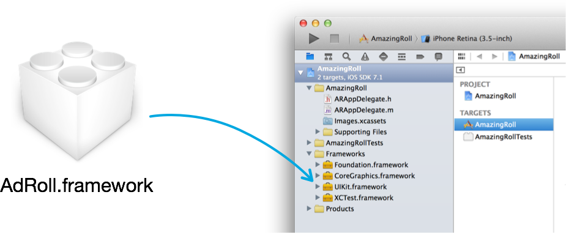
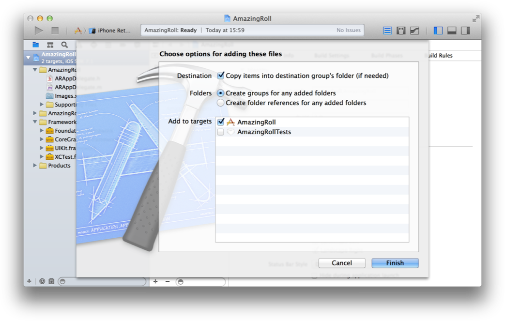
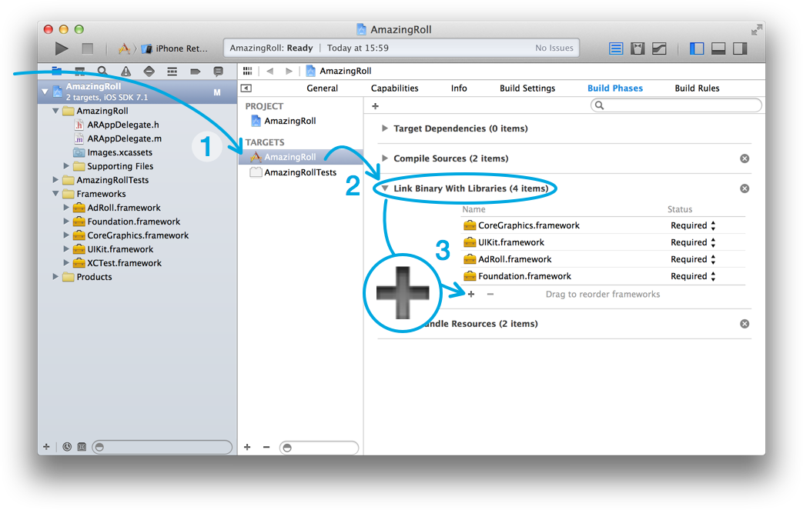

# AdRoll iOS SDK

The **AdRoll-iOS-SDK** framework enables [AdRoll](http://www.adroll.com) customers to retarget their native iOS app users. To create your **AdRoll** account and to learn more about how retargeting works, please visit: [www.adroll.com](http://www.adroll.com).


# Installation

## Cocoapods

[CocoaPods](http://cocoapods.org/) is a dependency manager for Objective-C, which automates and simplifies the process of using 3rd-party libraries like AdRoll-iOS-SDK in your projects.

Add to your Podfile the AdRoll pod:

```
pod 'AdRoll', :git => 'git@github.com:SemanticSugar/AdRoll-iOS-SDK.git'
```

Update your project dependencies with the command `$ pod install`. You should be now ready to jump to the [Integration](#Integration).


## Manual installation

### 1. Download the framework
Download the AdRoll-iOS-SDK framework with one of the following approaches:
	
- As a [git-submodule](http://git-scm.com/docs/git-submodule), run the following command on the console from your project's root directory:
	
	```
$ mkdir -p Vendor && git submodule add git@github.com:SemanticSugar/AdRoll-iOS-SDK.git Vendor/AdRoll
```
	
- As a zip file, click on the following link: [Download latest version](https://github.com/SemanticSugar/AdRoll-iOS-SDK/archive/master.zip)
	

### 2. Add the SDK to your app
From your current download destination, drag **AdRoll-iOS-SDK.framework** to your *Frameworks* group in Xcode.



Check to "*Copy items into destination group's folder (if needed)*" only if you downloaded the framework as a .zip file.




### 3. Add the dependencies

1. Click on *Targets* → Your app name → and then the *Build Phases* tab.
2. Expand the "*Link Binary With Libraries*" group.
3. Click the *+* button and add the following frameworks and libraries:
	- AdSupport.framework
	- libsqlite3.dylib
	- Security.framework
	



## Getting Started

### 1. Initialize the SDK

Add the following snippet of code in your `AppDelegate`, at the beginning of the `- (BOOL)application:(UIApplication *)application didFinishLaunchingWithOptions:(NSDictionary *)launchOptions` before any UI is loaded.

```objective-c
#import <AdRoll/AdRoll.h>

- (BOOL)application:(UIApplication *)application didFinishLaunchingWithOptions:(NSDictionary *)launchOptions
{
    [AdRoll initializeWithAdvertisableId:@"YOUR-ADVERTISABLE-ID" pixelId:@"YOUR-PIXEL-EID"];
							  
    // UI, State Recovery and any code that may trigger an event you will want to log...
    
    return YES;
}
```

Fill in `YOUR-ADVERTISABLE-ID` and `YOUR-PIXEL-EID` with the values you can find in your AdRoll account's dashboard. If you need help finding your *Advertisable Id* and *Pixel Id*, check out [http://support.adroll.com](http://support.adroll.com).


### 2. Log events to segment users

Discreet events can be logged referring to them by name using the static method `+ (void)logEvent:(NSString *)name` in the `AdRoll` class. For example:

```objective-c
// Standard event names are suggested in the SDK...
[AdRoll logEvent:AdRollEventName.Rated];
// ...but feel free to use your own custom ones
[AdRoll logEvent:@"subscribed"];
```

Additional information can be logged in the event as properties with method `+ (void)logEvent:(NSString *)name properties:(NSDictionary *)properties`. These can be used later for segmentation:

```objective-c
// The user does something worth segmenting by.
[AdRoll logEvent:AdRollEventName.AddedToCart
      properties:@{
                   // Standard property keys are provided in the SDK
                   AdRollEventPropertyProductId : @"PROD-1",
                   AdRollEventPropertyProductPrice : @(9.99),
                   // Your own custom properties are welcome!
                   @"color" : @"blue",
                   }];
```

You can find a complete list of suggested event names and property keys in the header file `AdRoll-Constants.h`.

Convenience methods are provided to log events in ecommerce apps. Find more details in the `AdRoll.h` header file:

```objective-c
+ (void)logEventProductViewed:(double)price currency:(NSString *)currency productId:(NSString *)productId productName:(NSString *)productName productType:(NSString *)productType properties:(NSDictionary *)properties;

+ (void)logEventAddedToCart:(double)price quantity:(int)quantity currency:(NSString *)currency productId:(NSString *)productId productName:(NSString *)productName productType:(NSString *)productType properties:(NSDictionary *)properties;

+ (void)logEventPurchase:(double)price quantity:(int)quantity currency:(NSString *)currency productId:(NSString *)productId productName:(NSString *)productName productType:(NSString *)productType properties:(NSDictionary *)properties;
```

### 3. Automatic app events

The AdRoll-iOS-SDK framework will automatically gather the following events for you to segment, once it is initialized:

- `app_start`: when the SDK is initialized, in the app's launch.
- `app_background`: when the app is brought to the background (ex. the user switches to another the app, is interrupted by a notification...).
- `app_foreground`: when the app is brought back to the foreground.
- `app_end`: when the app is terminated.


### 4. In App Purchase events

If the StoreKit framework is linked in the app, AdRoll-iOS-SDK framework will automatically log an event with name `purchase` for every In App Purchase through the App Store. The event will automatically include details for the products included. If the purchase was cancelled, a `purchase_cancel` event will be logged.

Automatic logging of In App Purchases can be disabled by invoking the following method right after the SDK initialization:

```objective-c 
[AdRoll disableAutomaticInAppPurchaseEventLogging];
```


### 5. User engagement

Engagement is key for mobile apps to be successful. The AdRoll-iOS-SDK framework will automatically log the event `active_time_60` when your user has been active more than 60 seconds in the app. This event can use to segment your engaged users.

In order to customize this event, get in touch with our Support team through [support.adroll.com](http://support.adroll.com).


### 6. Identify your users

You will be able to provide segmentation across devices by providing some user identifiers. You can optionally provide a user id, email or phone number that must be consistent throughout your service.

It is recommended that you set these values when your user is authenticated against your system, and every time the session is refreshed. Setting the user values is idempotent, and can be nilified to clear them up.

Example:

```objective-c
- (void)yourAuthenticationManager:(YourAuthenticationManager *)manager
              didAuthenticateUser:(YourUser *)yourUser
{
	// Do your stuff...
	
	// Tag the user for cross-device segmentation
	[AdRoll setUserId:yourUser.identifier];
	[AdRoll setUserEmail:yourUser.email];
	[AdRoll setUserPhoneNumber:yourUser.phoneNumber];
}
```

Remember to clear up these values when the user deauthenticates from your app:

```objective-c
- (void)yourAuthenticationManager:(YourAuthenticationManager *)manager
            didDeauthenticateUser:(YourUser *)yourUser
{
	// Do your stuff...
	
	// Invalidate the user information you set
	[AdRoll setUserId:nil];
	[AdRoll setUserEmail:nil];
	[AdRoll setUserPhoneNumber:nil];
}
```


### 7. Troubleshooting

The AdRoll-iOS-SDK framework will log to Console every time an issue is detected, avoiding crashes.

When compiling your application in `DEBUG` mode you have access to the method `+ (void)setVerboseLogging:(BOOL)enabled;` defined in the `AdRoll+Advanced.h`. A warning will be displayed a method if you try to build an app for Release with an invocation to this method.


# Offline behaviour

will group events to send them together in batches to minimize network usage and battery life; while still delivering them in a timely manner for the retargeting. Events logged while the device is offline will be stored in the app's sandbox and delivered when the app is back online.


# Advanced features

Advanced features are available under the `AdRoll+Advanced.h` header file. Please read the header documentation carefully and consult us through [Support](http://support.adroll.com) if you have any issue.


# About AdRoll

AdRoll is the global leader in retargeting, with over 15,000 active
advertisers worldwide. The company's innovative and easy-to-use
marketing platform enables brands of all sizes to create
personalized ad campaigns based on their own website data, ensuring
maximum return on online advertising spend. With a 97 percent
customer retention rate, AdRoll provides unmatched transparency and
reach across the largest display inventory sources, including
Google AdX, Twitter, and Facebook.

The company is backed by leading investors such as Foundation
Capital, Institutional Venture Partners, Northgate Capital,
GlenMede, Accel Partners, Merus Capital, and Peter
Thiel. 

For more information, please visit  
[www.adroll.com](http://www.adroll.com).

